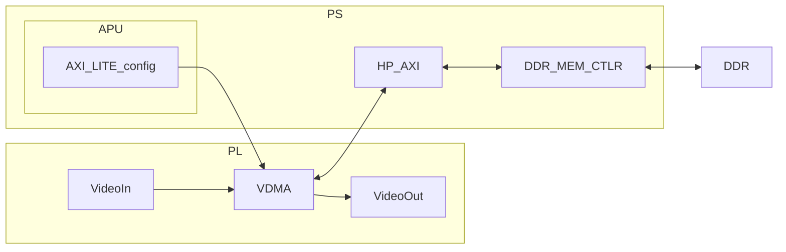



# Introduction
This blog covers the VDMA (and partly then DMA) and how it works and interacts with the processing system. I found this topic confusing and struggled to find resources that helped my understanding.

# What's happening
The VDMA block is specific IP block that specializes in storing video data frames through DMA or Direct memory access. All this means is that the PL handles all the writing and reading to the memory, which in most cases is off chip DDR (through or not through the PS).

It's primary job is to take streaming data (AXIS) and convert it into memory mapped data for a memory controller to grab and write/read into memory. The reverse is also true of grabbing memory mapped and streaming it out. 

The VDMA can be configured to specify how many frames you want stored at a time and a few other basic settings. Most of the configuration is done by the PS through the AXI lite interface.
Interrupts can be used whenever a frame is done being read or written. 

If the DDR is directly connected to the PL, a MIG block is used to generate the memory controller and interface to it. 
But, if the DDR is solely attached through the PS dedicated DDR ports, then the following setup must be used.

## Basic video data example through PS

This diagram shows the basic flow of video data throughout the SOC. 
Following the diagram from left to right, we see video data coming in (I omitted some processing blocks here) as Axi Stream data. Once it reaches the VDMA block, it is buffered there until it begins being read into the DDR through the PS DDR memory controller.

In order for this to happen, some software must be developed on the APU that configures the VDMA. This involves configuring, initializing, setting up channels, and beginning the transfers. But once this is done, the APU's job is done unless interrupts are configured. This is the strenght of DMA! The APU can go then do other post processing on the stored data.

# How to know this stuff
I initially pieced together this process with the help of ChatGPT, examples, and the IP datasheets, but if I were to do this again I would:
 - Develop a thorough understanding about what each PL IP does (What does it do? Make a block diagram or explain it)
 - Understand what the PS is capable, what is memory mapped already?
 - Focus on defining what your software on the PS must be capable of
 - Walk through the examples and tests for the software with a test hardware setup (ie. Loopback)

# Conclusion
